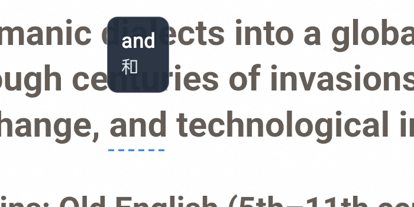
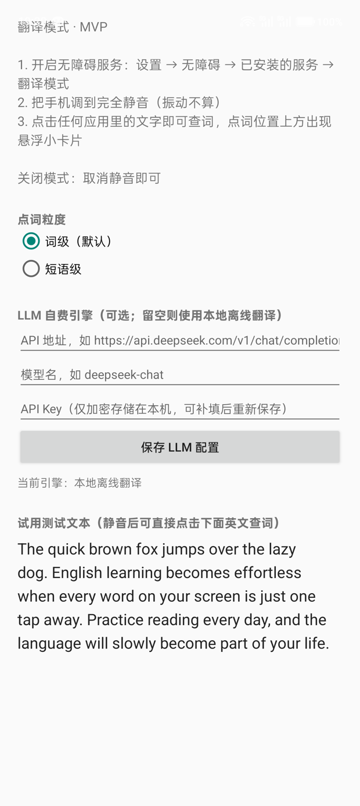

# TapTranslate · 翻译模式

**把手机调到完全静音，屏幕上的任何文字就变成可点击的单词卡片。**

点一下英文单词 → 词下方画出虚线、上方浮出迷你翻译卡片；滑动、返回、一切手势照常工作。把"查一个词"的成本从 5 秒压到 1 秒，让英语融入你的生活。



## 为什么是静音开关

物理三段式拨杆是最快的"模式开关"：拨到静音档 = 进入翻译模式；拨回 = 退出。无需打开任何 App、无需通知栏按钮。仅完全静音生效，振动档不算。

## 特性

- **全局点词**：任何渲染了系统文本的地方（浏览器、新闻、聊天、设置页）都能点；点击瞬间通过无障碍接口获取逐字符坐标，精确判定你点的是哪个词
- **悬浮小卡片**：锚定在被点词上方，靠近屏幕顶部自动翻到下方；水平方向自动钳制在屏内；点卡片外任意处消失
- **手势零冲突**：滑动经 `dispatchGesture` 累积-延迟一次回注给底层 App（专门解决回注事件弹回 overlay 自身的无限回环问题）
- **词级 / 短语级粒度**：词级为默认，词汇量大的用户可在设置页切到短语级
- **双翻译引擎**：ML Kit 本地离线（免费、无网、<50ms）；或填入自己的 OpenAI 兼容 LLM API（上下文感知释义，Key 经 Android Keystore AES-256/GCM 加密存本机）
- **无发音、无账号、无付费**——工具就该是工具

## 浏览器兼容性（实测）

| 浏览器 | 网页文字 | 逐字符坐标 | 结论 |
|---|---|---|---|
| Chrome / Edge | ✅ 标准 Chromium 无障碍桥 | ✅ 稳定 | **推荐，日常英文阅读主力** |
| OPPO 自带浏览器 | ✅ | ⚠️ 时好时坏（存根化，重进模式可恢复） | 凑合 |
| 夸克 | ❌ 只暴露一句标语，坐标返回常量矩形 | ❌ | 永远不支持 |

> WebView"撒谎"检测：节点对逐字符坐标请求返回全雷同矩形时（夸克典型行为），App 会诚实提示"该应用未暴露网页文字"，而不是编造翻译。


## 使用

1. 安装 APK（自行构建见下节）
2. 设置 → 无障碍 → 已安装的服务 → 翻译模式 → 开启
3. 手机拨到**完全静音**（振动不算）
4. 打开 Chrome 里的英文网页，点词即查；拨回铃声退出模式



**保活**：无障碍服务由系统绑定，被杀后自动重新拉起。建议在系统中关闭本应用的电池优化、在最近任务中锁定卡片、允许自启动。

## 构建

- JDK 17 + Android SDK（platform-35、build-tools 35.0.0）
- `./gradlew assembleDebug` → `app/build/outputs/apk/debug/app-debug.apk`
- 仓库未包含 `gradle-wrapper.jar`（二进制）：用 Android Studio 打开会自动生成，或本机装 Gradle 8.7+ 后执行 `gradle wrapper`
- gradle wrapper 默认指向腾讯镜像（方便国内用户）；海外用户请改回 `https\://services.gradle.org/distributions/gradle-8.7-bin.zip`
- 工程路径含中文/空格时需 `android.overridePathCheck=true`（已写入 gradle.properties）

## 架构

详见 [docs/架构设计.md](docs/架构设计.md)。核心链路：

```
点击 → 选窗口(跳过自家overlay) → DFS最深文本节点
     → refreshWithExtraData 逐字符坐标（含撒谎检测/重试/重走树）
     → 分词(英文空格/CJK逐字) → 命中测试取词 + 整句上下文
     → ML Kit 或 LLM 翻译 → 虚线 + 悬浮卡片
滑动 → 累积路径 → 单段 dispatchGesture 回注（overlay 同步置 NOT_TOUCHABLE 防回环）
```

## 明确不支持（设计决定）

- ❌ 游戏 / 视频里的文字——那是图像像素不是文本节点，要做得走截屏+OCR 另一条管线
- ❌ 整屏预加虚线 / 整屏双语渲染——性能与系统权限都不允许
- ❌ iOS

## 已知限制

- ML Kit 孤立多义词可能失真（如 away→"距离酒店"）；LLM 引擎为此预留
- 回注无挥动惯性：快速甩动是匀速滚动；连续滑动从第二指起直接原生滚动（反而更顺）
- 浏览器坐标服务在无障碍会话"老化"后可能存根化，表现为点词退化为整段翻译——拨动静音开关重启模式即恢复
- 短语级合并是启发式（间隔 < 0.8 行高、最多 3 词）

## 隐私

- LLM API Key 仅经 Keystore 加密后存本机私有目录，不上传、不进日志
- 仅与你在设置页填写的 endpoint 通信；ML Kit 模型本地下载后完全离线

## License

[MIT](LICENSE)
